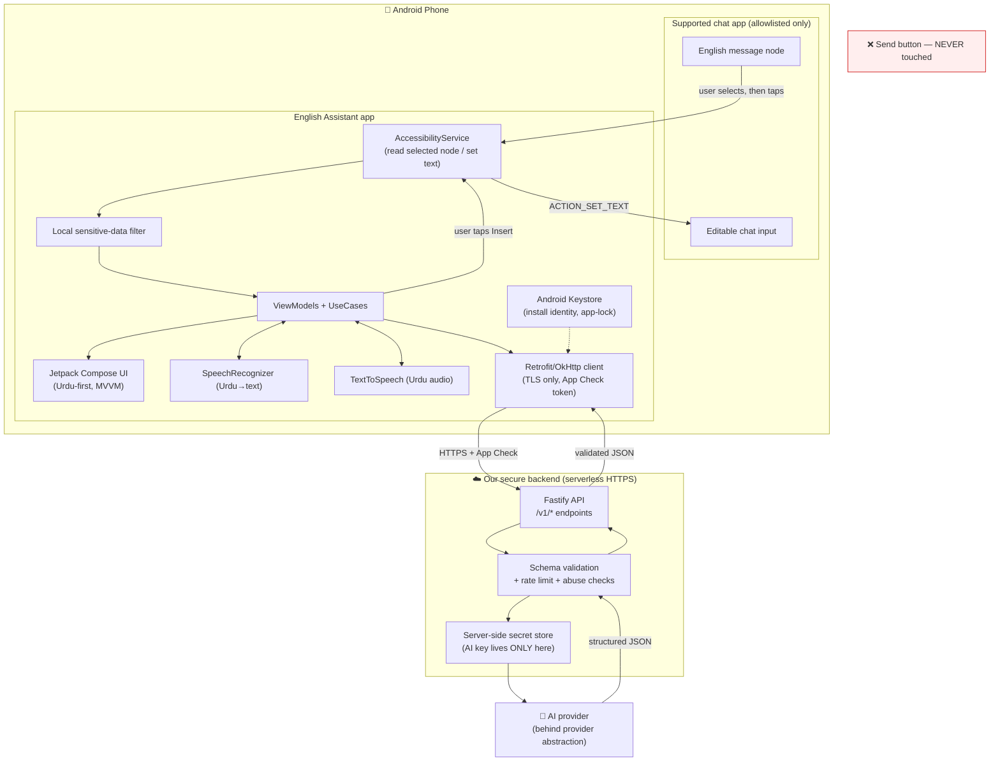

# Architecture

**Phase 0 deliverable.** How English Assistant is put together, and why.

---

## 1. High-level system diagram



**The one line to remember:** the app only ever moves in response to a user tap,
it only reads the node the user targeted, and the AI key lives **only** on the
server.

---

## 2. Chosen technology stack (decisions made for you)

| Layer | Choice | Why (plain English) |
|-------|--------|----------------------|
| Language | **Kotlin** | The modern, official Android language; safest against null-pointer crashes. |
| UI | **Jetpack Compose + Material 3** | Lets us build large, Urdu-first buttons quickly and keep screens simple. |
| Architecture | **Clean Architecture + MVVM, one-way data flow** | Keeps logic testable and screens predictable; standard, well-documented. |
| Dependency injection | **Hilt** | The standard Android way to wire pieces together without fragile glue code. |
| Async | **Coroutines + Flow** | Cancels stale AI requests cleanly; keeps the UI responsive. |
| Networking | **Retrofit + OkHttp** | The de-facto standard; easy TLS pinning and timeouts. |
| JSON | **kotlinx.serialization** | Strict, safe parsing of the AI's structured replies. |
| Preferences | **Jetpack DataStore** | Simple, modern settings storage (no chat content stored). |
| Secrets on device | **Android Keystore** | Hardware-backed storage for the install identity and optional app-lock. |
| Speech in | **Android SpeechRecognizer** (Urdu locale detection) | Built into Android; no extra SDK; on-device where supported. |
| Speech out | **Android TextToSpeech** (Urdu voice detection) | Built in; reads Urdu aloud when the voice pack exists. |
| Screen integration | **AccessibilityService + Process Text + Share + clipboard** | Layered fallbacks so failure in one path is not failure overall. |
| Backend | **TypeScript + Node.js + Fastify** (serverless HTTPS) | Small, fast, well-supported; hides the AI key. Firebase Functions is an accepted alternative if it is easier for the owner. |
| App integrity | **Firebase App Check + Play Integrity** | Stops the backend from being an open, abusable proxy without needing user logins. |

### Minimum & target SDK

- **minSdk = 26 (Android 8.0).** Covers the large majority of active devices,
  gives us modern `AccessibilityService` node APIs, scoped behaviour, and
  reliable TLS. Going lower buys little reach for real security/maintenance cost.
- **targetSdk = current Play requirement at build time** (Android 15 / API 35 as
  of this writing), because Google Play mandates a recent target SDK.

---

## 3. Project / package structure

We **start with a single Android app module** (`:app`) with clean internal
packages — this is the beginner-friendly choice and avoids first-build pain. A
later modularization plan is included below.

```
english-assistant/
├── README.md
├── docs/                      # all Phase 0 documents (this folder)
├── backend/                   # TypeScript secure proxy (built in Phase 3)
│   ├── README.md
│   └── .env.example           # NEVER contains a real key
└── android/                   # the Android project (created in Phase 1)
    ├── settings.gradle.kts
    ├── build.gradle.kts
    ├── gradle/                # version catalog (libs.versions.toml)
    └── app/
        └── src/
            ├── main/
            │   ├── AndroidManifest.xml
            │   ├── res/                       # Urdu strings, large-button themes
            │   └── java/com/englishassistant/
            │       ├── EnglishAssistantApp.kt          # @HiltAndroidApp
            │       ├── core/
            │       │   ├── model/                      # immutable data models, sealed UI states
            │       │   ├── security/                   # sensitive-data filter, redaction, allowlist
            │       │   ├── network/                    # Retrofit, App Check, DTOs, schema guards
            │       │   └── ui/                          # shared Compose components, Urdu theme
            │       ├── accessibility/
            │       │   ├── AssistantAccessibilityService.kt
            │       │   ├── PackageAllowlist.kt          # single source of truth for supported apps
            │       │   ├── TextCapture.kt               # safe read of targeted node
            │       │   └── TextInsertion.kt             # ACTION_SET_TEXT + clipboard fallback
            │       ├── feature/
            │       │   ├── onboarding/                  # first-run Urdu tutorial + disclosure
            │       │   ├── assistant/                   # translation panel + suggested reply
            │       │   ├── voice/                       # Speak-Urdu flow, TTS
            │       │   └── settings/                    # pause, app-lock, clear data, test mode
            │       └── di/                              # Hilt modules
            └── test/ + androidTest/                     # unit + instrumented tests, fake chat screen
```

**Consistent application ID / package name:** `com.englishassistant` (locked now,
used everywhere).

### Later modularization plan (not for the first build)

Once the single-module app is working and tested, split along these seams, which
already match the package layout above:

`:core-model`, `:core-security`, `:core-network`, `:core-ui`, `:accessibility`,
`:feature-onboarding`, `:feature-assistant`, `:feature-voice`, `:feature-settings`,
with `:app` wiring them together. Because the packages are already isolated, this
becomes a mechanical move rather than a rewrite.

---

## 4. AI provider abstraction

To allow changing the AI provider without rewriting the app, all AI work sits
behind interfaces **on the backend**, with the Android client only ever talking to
our own `/v1/*` endpoints:

- `TranslationProvider` — English → Urdu meaning + intent.
- `ReplySuggestionProvider` — one safe English reply.
- `BackTranslationProvider` — English reply → Urdu meaning.

Provider-specific code (and the key) never reaches the phone. Swapping providers is
a backend change only.

---

## 5. Layer responsibilities (Clean Architecture)

- **UI (Compose)** — renders sealed `UiState`; no business logic; Urdu-first.
- **ViewModel** — holds transient state, cancels stale requests, exposes `Flow`.
- **UseCase** — one job each (TranslateMessage, SuggestReply, SpeakUrdu, …).
- **Repository** — talks to the backend and to accessibility; hides details.
- **Accessibility layer** — the only code that touches other apps' nodes.
- **Security layer** — the local sensitive-data filter and redaction, called
  **before** any network use.

All chat text lives in memory only for the active task and is cleared when the
panel is dismissed (see `DATA_FLOW.md` and `PRIVACY.md`).
