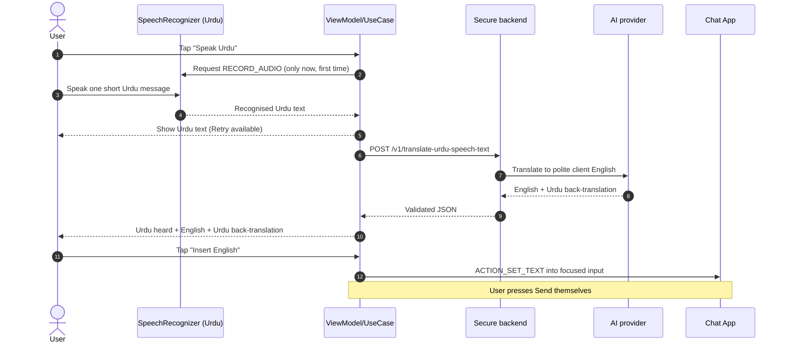
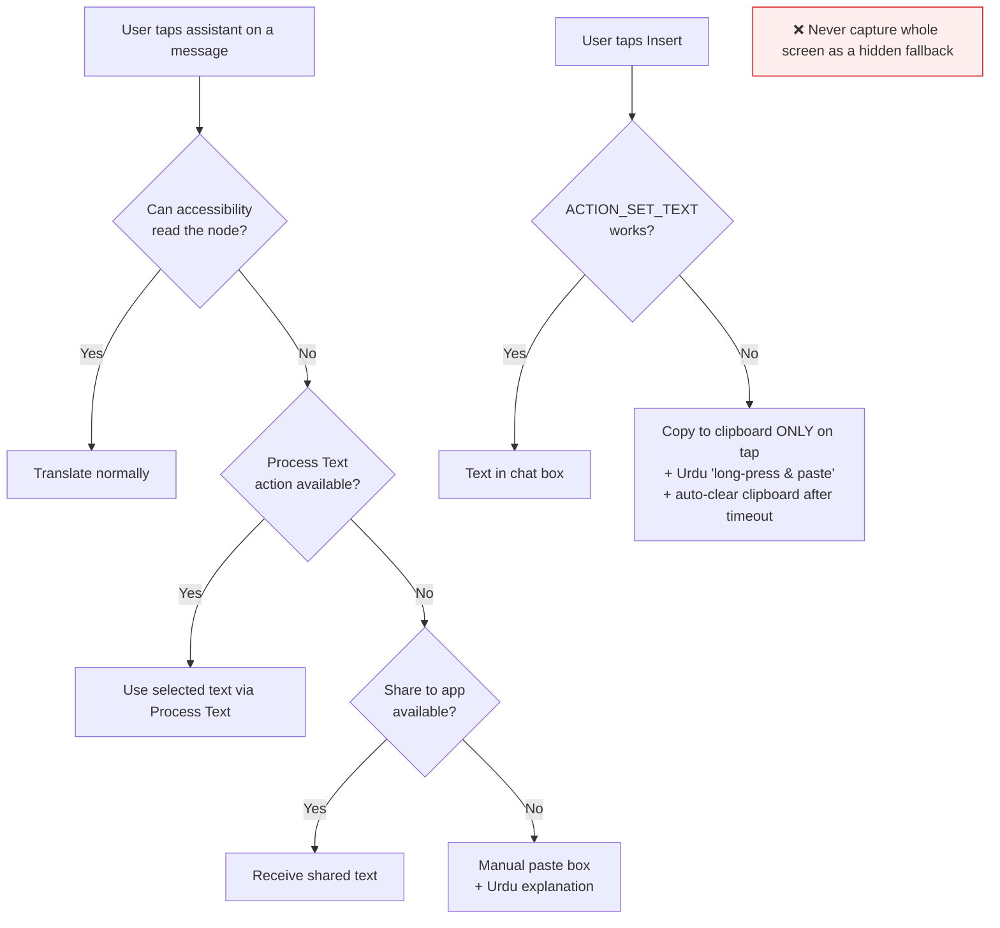

# Data Flow

**Phase 0 deliverable.** Exactly how a piece of text moves through the system, and
where it is (and is not) allowed to go.

---

## 1. Translate-a-message flow (Flow 1)

```mermaid
sequenceDiagram
    autonumber
    actor U as User
    participant App as Chat App (allowlisted)
    participant A11y as AccessibilityService
    participant Sec as Local sensitive-data filter
    participant VM as ViewModel/UseCase
    participant BE as Secure backend
    participant AI as AI provider

    U->>App: Select English message
    U->>A11y: Tap English Assistant button
    A11y->>A11y: Read ONLY the selected/focused node
    A11y->>A11y: Reject password fields, blank, over-length, hidden
    A11y->>Sec: Targeted text (trimmed, length-limited)
    Sec->>Sec: Screen for password/OTP/card/IBAN/seed/ID
    alt Sensitive detected
        Sec-->>VM: BLOCKED
        VM-->>U: Urdu warning — nothing sent
    else Safe
        Sec->>VM: Clean text
        VM->>BE: POST /v1/translate-message (min text + App Check token)
        BE->>BE: Validate size/schema/rate-limit; treat text as untrusted DATA
        BE->>AI: Prompt-injection-resistant request
        AI-->>BE: Structured JSON
        BE->>BE: Validate JSON, enforce lengths, strip unknown fields
        BE-->>VM: Validated JSON (Urdu meaning, 1 reply, reply's Urdu meaning)
        VM-->>U: Urdu meaning + Listen + 1 English reply + its Urdu meaning
        U->>VM: Tap "Insert English reply"
        VM->>A11y: Insert request (fresh explicit tap)
        A11y->>A11y: Verify package allowlisted + field still focused
        A11y->>App: ACTION_SET_TEXT into editable field
        Note over A11y,App: ❌ Send is NEVER pressed
        A11y->>A11y: Clear captured node reference
    end
```

## 2. Speak-Urdu flow (Flow 2)



## 3. Fallback paths



---

## 4. Step-by-step data lifecycle (canonical)

1. User **explicitly** selects or focuses text.
2. Accessibility layer returns **only** the targeted text.
3. Local privacy filter screens it (block sensitive; otherwise pass).
4. Text is **normalised** (Unicode NFC, control chars/null bytes stripped) and
   **length-limited**.
5. App builds a **minimal** AI request (only what is needed).
6. Secure backend proxy forwards it to the AI provider over HTTPS.
7. AI returns **structured JSON**.
8. Backend **validates and filters** the response (schema, lengths, enums).
9. Android app **validates again** before using it.
10. UI shows Urdu meaning + one reply + the reply's Urdu meaning.
11. User **explicitly approves** insertion with a fresh tap.
12. Accessibility layer inserts text into the **currently focused editable** field.
13. Temporary text is **cleared from memory** as soon as reasonably possible
    (panel dismissed → ViewModel state cleared → node reference released).

## 5. Where text is NOT allowed to go

- **Never** to disk by default (no conversation history).
- **Never** to logs (see `SECURITY.md` logging rules) — not the message, not the
  translation, not the reply, not the speech transcript.
- **Never** to analytics or an ad SDK (there are none).
- **Never** to the clipboard except on an explicit tap in the insertion fallback,
  and then auto-cleared after a short timeout where supported.
- **Never** to the AI if the local filter flags it as sensitive.
- **Never** stored in request/response bodies on the backend.
